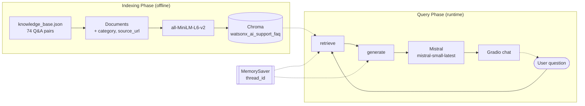

# RAG-Powered Customer Support Chatbot for IBM watsonx.ai

OnRampV2 is a Retrieval Augmented Generation (RAG) chatbot that answers customer support questions about IBM watsonx.ai, built with LangChain, LangGraph, Chroma, sentence-transformers, Mistral AI and Gradio. It answers only watsonx.ai questions, and every response is grounded in a curated knowledge base of 74 question and answer pairs written from public IBM product pages, each carrying the page it came from.


## 🚀 Features

- **Knowledge Base Integration**: Load and process watsonx.ai support documentation from a JSON file, with category and source URL metadata on every pair
- **Semantic Search**: Use vector embeddings for intelligent document retrieval
- **Conversation Memory**: Maintain context across multi-turn conversations, rewriting short follow-up questions so retrieval still has a subject to match
- **Response Generation**: Ensure all responses are grounded in the knowledge base, scoped to watsonx.ai, and free of quoted prices
- **Web Interface**: User-friendly Gradio interface with click-to-fill example questions
- **Session Management**: Handle multiple conversations through LangGraph thread IDs
- **Real-time Responses**: Powered by Mistral AI's small model with 131k token context window

## 🏗️ Architecture

The system implements a two-phase RAG architecture:

### Indexing Phase
1. **Document Loading**: Parse the JSON knowledge base into structured documents
2. **Text Processing**: Configure a splitter; FAQ pairs are already chunk-sized and pass through intact
3. **Embedding**: Convert text to vector representations using sentence-transformers
4. **Storage**: Store embeddings in a Chroma vector database

### Query Phase
1. **Retrieval**: Find semantically similar documents for user queries
2. **Context Assembly**: Combine retrieved information with conversation history
3. **Generation**: Generate responses using Mistral AI
4. **Memory Persistence**: Maintain conversation state across interactions



## 📋 Prerequisites

- Python 3.10+
- Mistral AI API key ([Get one here](https://docs.mistral.ai/getting-started/quickstart/))

## 📁 Project Structure

```
onrampv2/
├── onrampv2_watsonx_support_chatbot.ipynb    # Main implementation notebook
├── knowledge_base.json                       # watsonx.ai FAQ, 74 pairs, 7 categories
├── LICENSE                                   # MIT
├── .gitattributes
├── .gitignore
└── README.md                                 # This file
```

## 🚀 Quick Start

1. **Clone the repository**
   ```bash
   git clone https://github.com/trishamain/onrampv2.git
   cd onrampv2
   ```

2. **Set up your API key**

   **Option A: Environment Variable**
   ```bash
   export MISTRAL_API_KEY="your-api-key-here"
   ```

   **Option B: Google Colab Secrets** (if using Colab)
   - Go to the secrets panel in Colab
   - Add `MISTRAL_API_KEY` with your API key

   **Option C: Manual Entry**
   - The notebook will prompt you to enter your API key if not found

3. **Run the notebook**
   - Open `onrampv2_watsonx_support_chatbot.ipynb` in Jupyter or Google Colab
   - Run all cells sequentially
   - The Gradio interface will launch from the final cell

## 📝 Usage Examples

<!-- TODO: paste real transcripts from the executed notebook.
     The cells that produce them (Part 1 test questions, test_conversation,
     and the out-of-scope check) are tagged skip-execution and have no
     outputs until MISTRAL_API_KEY is set and the notebook is re-executed.
     Nothing is written here yet because no answer has actually been
     generated, and inventing one would misrepresent the system. -->

_Pending. These examples are copied verbatim from the executed notebook, and the cells that generate them have not been run yet — see the note in the source of this section._

## 🔧 Configuration

### Model Settings
```python
llm = ChatMistralAI(
    model="mistral-small-latest",
    temperature=0.5,      # Controls response randomness
    max_tokens=512        # Maximum response length
)
```

### Retrieval Settings
```python
# Number of documents to retrieve
retrieved_docs = vector_store.similarity_search(query, k=2)

# Embedding model configuration
embeddings = HuggingFaceEmbeddings(
    model_name="sentence-transformers/all-MiniLM-L6-v2"
)
```

## 📊 Knowledge Base Format

The system expects a JSON file with the following structure:

```json
{
  "knowledge_base": [
    {
      "category": "PLATFORM OVERVIEW",
      "questions": [
        {
          "question": "What is IBM watsonx.ai?",
          "answer": "watsonx.ai is IBM's studio for building and running AI...",
          "source_url": "https://www.ibm.com/products/watsonx-ai"
        }
      ]
    }
  ]
}
```

`source_url` is optional. Pairs without one fall back to the watsonx.ai product page.

| Category | Pairs |
|---|---|
| PLATFORM OVERVIEW | 9 |
| FOUNDATION MODELS | 15 |
| RAG DEVELOPMENT | 10 |
| MODEL CUSTOMIZATION & TUNING | 9 |
| DEPLOYMENT & DEVELOPER TOOLS | 10 |
| PLANS & PRICING | 11 |
| GETTING STARTED & SUPPORT | 10 |
| **Total** | **74** |

## 🔍 Key Components

### 1. Document Processing
- Loads FAQ data from JSON format
- Creates LangChain `Document` objects with metadata
- Preserves category, original question and source URL

### 2. Vector Storage
- Uses Chroma for a local vector database
- Stores document embeddings for semantic search

### 3. Conversation Management
- Implements LangGraph's `MessagesState` for conversation tracking
- Uses `MemorySaver` for session persistence
- Supports multiple concurrent conversations

### 4. Response Generation
- Grounds all responses in the knowledge base
- Maintains conversation context
- Declines questions outside watsonx.ai and avoids quoting prices

## 🛠️ Differences from the reference implementation

- **API key name**: the non-Colab fallback reads `MISTRAL_API_KEY`, the same name used in Colab secrets, instead of a second unrelated variable
- **Per-turn context**: `generate()` uses only the `ToolMessage` objects added after the latest human message, so retrieved context does not accumulate across turns
- **Guaranteed return**: `process_message()` initialises `response` before the loop, so a turn with no AI message returns a readable message instead of raising
- **Follow-up retrieval**: a follow-up question of eight words or fewer borrows the previous question as its retrieval query, so short questions still match something
- **Example questions**: the Gradio interface adds a `gr.Examples` row of four click-to-fill questions
- **Gradio 6**: `gr.Chatbot` is constructed without the `type` argument, which Gradio 6 removed since the messages format is now the default, and the `css` argument is passed to `demo.launch()` rather than the `gr.Blocks()` constructor, which Gradio 6 moved

## ⚠️ Disclaimer

OnRampV2 is an independent personal learning project by Trisha Mainali. It is not affiliated with, endorsed by, or sponsored by IBM. Knowledge base answers are written in our own words from public IBM product pages, each linked by source_url. For current plans and pricing, see the official IBM watsonx.ai pricing page. IBM, watsonx, watsonx.ai, and Granite are trademarks of IBM Corporation.

## 🙏 Acknowledgments

- [LangChain](https://python.langchain.com/) for the RAG framework
- [LangGraph](https://langchain-ai.github.io/langgraph/) for workflow orchestration
- [Mistral AI](https://docs.mistral.ai/getting-started/quickstart/) for the language model
- [Gradio](https://www.gradio.app/docs/) for the web interface
- Structure inspired by [ejazalam831/rag-customer-support-chatbot](https://github.com/ejazalam831/rag-customer-support-chatbot) (MIT)

---

⭐ If this project helped you, please give it a star! It helps others discover the project.
